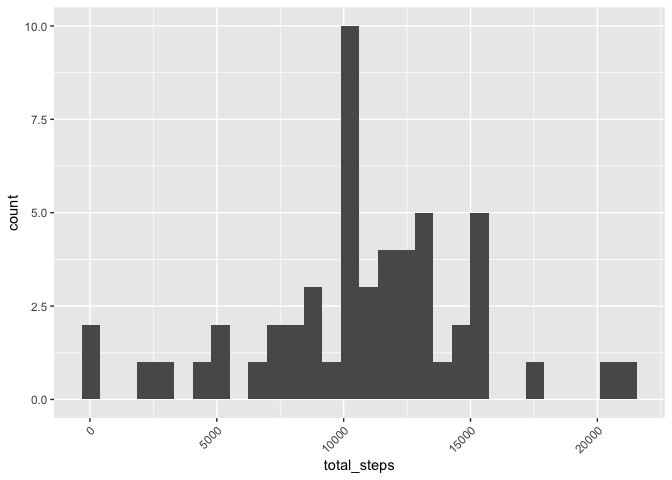
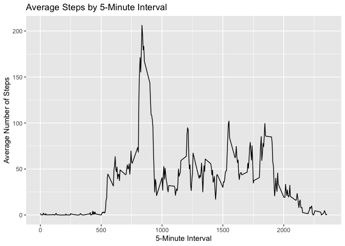
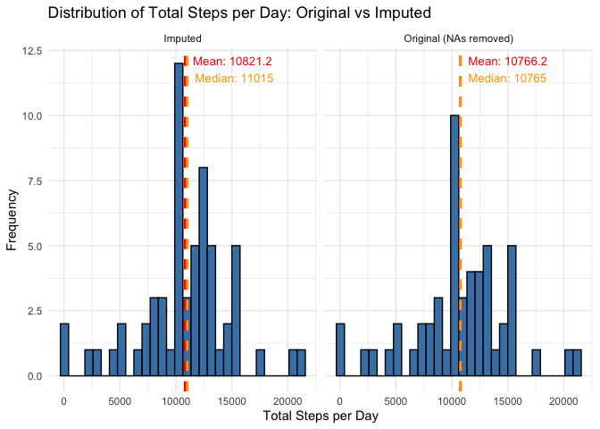
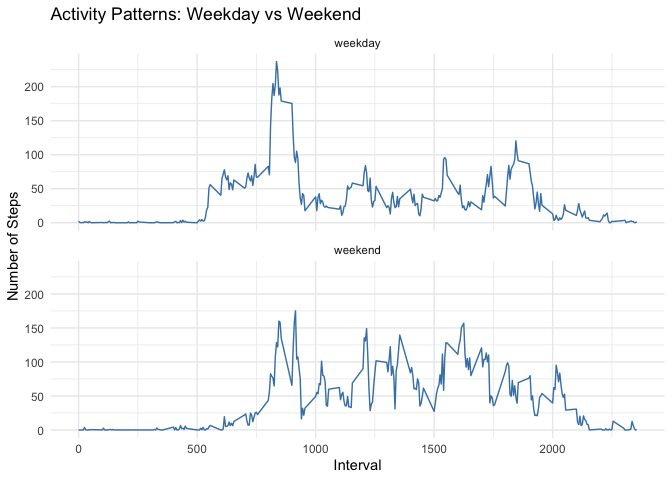

Peer-graded Assignment: Course Project 1
================

``` r
pkg_setup <- function(...) {
      pkgs <- c(...)
      new_pkgs <- pkgs[!(pkgs %in% installed.packages()[, "Package"])]
      if (length(new_pkgs)) install.packages(new_pkgs)
      invisible(sapply(pkgs, library, character.only = TRUE))
}
pkg_setup("usethis", "gitcreds","tidyr","tidyverse")
```

    ## ── Attaching core tidyverse packages ──────────────────────── tidyverse 2.0.0 ──
    ## ✔ dplyr     1.1.4     ✔ purrr     1.2.0
    ## ✔ forcats   1.0.1     ✔ readr     2.1.6
    ## ✔ ggplot2   4.0.1     ✔ stringr   1.6.0
    ## ✔ lubridate 1.9.4     ✔ tibble    3.3.0
    ## ── Conflicts ────────────────────────────────────────── tidyverse_conflicts() ──
    ## ✖ dplyr::filter() masks stats::filter()
    ## ✖ dplyr::lag()    masks stats::lag()
    ## ℹ Use the conflicted package (<http://conflicted.r-lib.org/>) to force all conflicts to become errors

#### Loading and preprocessing the data

``` r
temp <- tempfile()
download.file("https://d396qusza40orc.cloudfront.net/repdata%2Fdata%2Factivity.zip",temp)
data <- read.csv(unz(temp, "activity.csv"))
unlink(temp)
```

#### What is mean total number of steps taken per day?

``` r
data %>%
  # ignore the missing values in the dataset
  filter(!is.na(steps)) %>%
  group_by(date) %>%
  summarise(total_steps = sum(steps)) %>%
  ggplot(aes(x = total_steps)) +
  geom_histogram() +
  theme(axis.text.x = element_text(angle = 45, hjust = 1))
```

    ## `stat_bin()` using `bins = 30`. Pick better value `binwidth`.

<!-- --> \####
Mean and median number of steps taken each day

On average, approximately 1.07662^{4} steps are being taken each day,
with median steps of 1.0765^{4} being taken.

#### What is the average daily activity pattern?

``` r
# Create the plot
data %>%
  filter(!is.na(steps)) %>%
  group_by(interval) %>%
  summarise(avg_steps = mean(steps)) %>%
  ggplot(aes(x = interval, y = avg_steps)) +
  geom_line() +
  labs(x = "5-Minute Interval", 
       y = "Average Number of Steps",
       title = "Average Steps by 5-Minute Interval")
```

<!-- --> \####
Which 5-minute interval, on average across all the days in the dataset,
contains the maximum number of steps?

``` r
max_interval <- data %>%
  filter(!is.na(steps)) %>%
  group_by(interval) %>%
  summarise(avg_steps = mean(steps)) %>%
  arrange(desc(avg_steps)) %>%
  slice(1)

print(max_interval)
```

    ## # A tibble: 1 × 2
    ##   interval avg_steps
    ##      <int>     <dbl>
    ## 1      835      206.

#### Imputing missing values

#### Calculate and report the total number of missing values in the dataset

``` r
data %>%
  summarise(na_count = sum(is.na(steps)),
            total_count = n(),
            na_percent = (na_count / total_count) * 100)
```

    ##   na_count total_count na_percent
    ## 1     2304       17568   13.11475

#### Imputed missing

``` r
# Create imputed column while keeping original steps
data <- data %>%
  mutate(day_of_week = wday(date, label = TRUE)) %>%
  group_by(day_of_week, interval) %>%
  mutate(steps_imputed = ifelse(is.na(steps), 
                                mean(steps, na.rm = TRUE), 
                                steps)) %>%
  ungroup()

# Now calculate stats for both
original_stats <- data %>%
  filter(!is.na(steps)) %>%
  group_by(date) %>%
  summarise(total_steps = sum(steps)) %>%
  summarise(mean_steps = mean(total_steps),
            median_steps = median(total_steps))

imputed_stats <- data %>%
  group_by(date) %>%
  summarise(total_steps = sum(steps_imputed)) %>%
  summarise(mean_steps = mean(total_steps),
            median_steps = median(total_steps))

# Calculate differences
comparison <- data.frame(
  metric = c("Mean", "Median"),
  original = c(original_stats$mean_steps, original_stats$median_steps),
  imputed = c(imputed_stats$mean_steps, imputed_stats$median_steps)
) %>%
  mutate(difference = imputed - original,
         percent_change = round(((imputed - original) / original) * 100, 2))

print(comparison)
```

    ##   metric original  imputed difference percent_change
    ## 1   Mean 10766.19 10821.21   55.02092           0.51
    ## 2 Median 10765.00 11015.00  250.00000           2.32

#### Histogram of total number of steps taken each day

``` r
# Prepare data for both original and imputed
plot_data <- bind_rows(
  data %>%
    filter(!is.na(steps)) %>%
    group_by(date) %>%
    summarise(total_steps = sum(steps)) %>%
    mutate(type = "Original (NAs removed)"),
  
  data %>%
    group_by(date) %>%
    summarise(total_steps = sum(steps_imputed)) %>%
    mutate(type = "Imputed")
)

# Calculate stats for annotations
stats <- plot_data %>%
  group_by(type) %>%
  summarise(mean_steps = mean(total_steps),
            median_steps = median(total_steps))

# Create faceted histogram with annotations
ggplot(plot_data, aes(x = total_steps)) +
  geom_histogram(bins = 30, fill = "steelblue", color = "black") +
  geom_vline(data = stats, aes(xintercept = mean_steps), 
             color = "red", linetype = "dashed", linewidth = 1) +
  geom_vline(data = stats, aes(xintercept = median_steps), 
             color = "orange", linetype = "dashed", linewidth = 1) +
  geom_text(data = stats, aes(x = mean_steps, y = Inf, 
                               label = paste("Mean:", round(mean_steps, 1))),
            vjust = 2, hjust = -0.1, color = "red", size = 3.5) +
  geom_text(data = stats, aes(x = median_steps, y = Inf, 
                               label = paste("Median:", round(median_steps, 1))),
            vjust = 4, hjust = -0.1, color = "orange", size = 3.5) +
  facet_wrap(~ type, ncol = 2) +
  labs(x = "Total Steps per Day", 
       y = "Frequency",
       title = "Distribution of Total Steps per Day: Original vs Imputed") +
  theme_minimal()
```

<!-- --> By
imputing missing values using the average total steps based upon the day
of the week, we increase the mean and median by 0.51% and 2.32%,
respectively.

#### Create weekday/weekend factor variable

``` r
data <- data %>%
  mutate(day_type = factor(
    ifelse(wday(date) %in% c(1, 7), "weekend", "weekday"),
    levels = c("weekday", "weekend")
  ))
```

#### Create panel plot with time series:

``` r
data %>%
  group_by(day_type, interval) %>%
  summarise(avg_steps = mean(steps_imputed, na.rm = TRUE), .groups = "drop") %>%
  ggplot(aes(x = interval, y = avg_steps)) +
  geom_line(color = "steelblue") +
  facet_wrap(~ day_type, ncol = 1) +
  labs(x = "Interval",
       y = "Number of Steps",
       title = "Activity Patterns: Weekday vs Weekend") +
  theme_minimal()
```

<!-- -->
